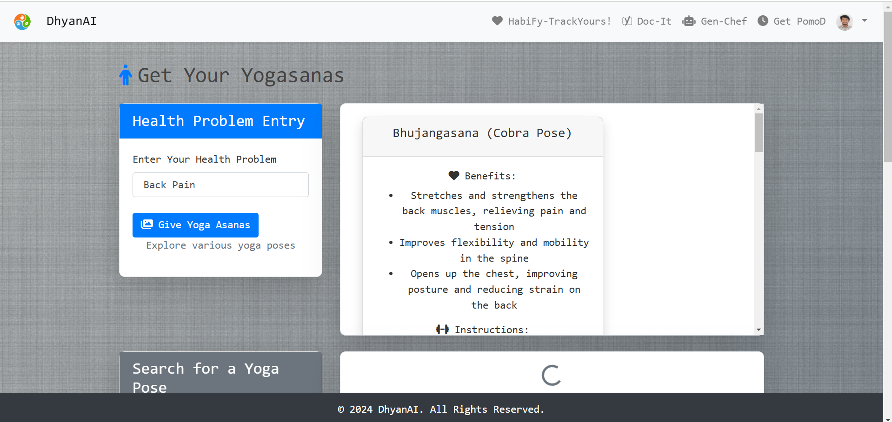
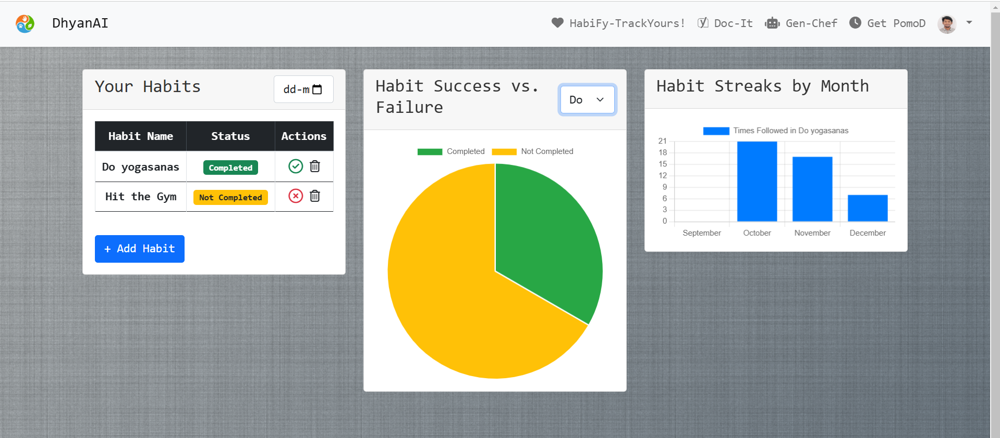
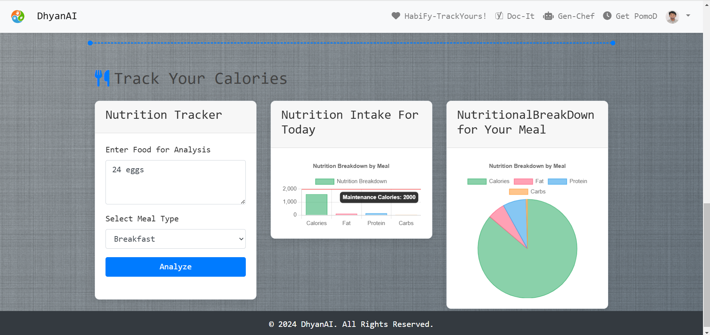

# Dhyan AI

**Dhyan AI** is an all-in-one health and well-being web application designed to enhance users' lifestyles through personalized yoga recommendations, habit tracking, health recipe suggestions, and productivity tools.

---

## 🌟 **Features**

### 🧨 Yoga Recommendations
- **Personalized Yogasana Recommendations** based on your health issues.
- Utilizes **SambaNova AI Cloud Services** and the **Meta LLM model** to generate relevant yoga asanas.
- Detailed instructions and benefits for each yogasana are provided.

### 📊 Habit Tracking
- Track daily habits such as water intake, exercise, and yoga.
- View insightful **monthly statistics** to monitor progress and improve health.

### 🥗 Health Recipe Recommendations
- Get personalized **health recipes** by entering the ingredients you have.
- Uses **Meta LLM** on SambaNova AI Cloud Services to provide accurate and healthy meal suggestions.

### ⏱️ Pomodoro Timer
- Boost productivity with the **Pomodoro Technique**.
- Manage and track your activities effectively by dividing your time into focused work sessions and breaks.

### 🔐 AWS Cognito Authentication
- Secure and seamless **login and authentication** using AWS Cognito.

---

## 🛠️ **Tech Stack**

- **Frontend**: HTML, EJS, Bootstrap
- **Backend**: Node.js with Express
- **Database**: MongoDB
- **AI Services**: SambaNova AI Cloud Services (Meta LLM model)
- **Authentication**: AWS Cognito

---

## 🚀 **Getting Started**

Follow the steps below to set up and run the Dhyan AI application locally.

### Prerequisites

Ensure you have the following installed:

- [Node.js](https://nodejs.org/en/) (v14 or above)
- [MongoDB](https://www.mongodb.com/try/download/community)
- [SambaNova API Access](https://sambanova.ai/)
- [AWS Cognito Setup](https://aws.amazon.com/cognito/)

### Installation

1. **Clone the repository**:

   ```bash
   git clone https://github.com/Rajukrsna/DhyanAI.git
   cd dhyan-ai
   ```

2. **Install dependencies**:

   ```bash
   npm install
   ```

3. **Set up environment variables**:

   Create a `.env` file in the root directory and add the following:

   ```plaintext
   PORT=3000
   MONGODB_URI=your-mongodb-uri
   SAMBANOVA_API_KEY=your-sambanova-api-key
   AWS_COGNITO_CLIENT_ID=your-cognito-client-id
   AWS_COGNITO_USER_POOL_ID=your-cognito-user-pool-id
   ```

4. **Run the application**:

   ```bash
   npm start
   ```

5. **Open the application**:

   Visit `http://localhost:3000` in your browser.

---

## 📂 **Project Structure**

```
.
├── views/           # EJS templates
├── public/          # Static files (CSS, JS, images)
├── routes/          # Express routes
├── models/          # Mongoose models
├── app.js           # Main server file
├── package.json     # Project dependencies
└── .env             # Environment variables
```

---

## 🖼 **Screenshots**

### 1. **Yoga Recommendations**


### 2. **Habit Tracking**


### 3. **Nutritional Analysis**


---

## 🫏️ **Contributing**

Contributions are welcome! Please follow these steps:

1. **Fork the repository**.
2. **Create a new branch**:
   ```bash
   git checkout -b feature/your-feature-name
   ```
3. **Commit your changes**:
   ```bash
   git commit -m "Add new feature"
   ```
4. **Push to the branch**:
   ```bash
   git push origin feature/your-feature-name
   ```
5. **Open a Pull Request**.

---

## 📄 **License**

This project is licensed under the [MIT License](LICENSE).

---

## 📩 **Contact**

For any questions or suggestions, reach out to:

- **Email**: tmpravinraju@gmail.com
- **LinkedIn**: [Your LinkedIn Profile](www.linkedin.com/in/pravin-raju-t-m-164648252)

---

### ⭐ **If you like this project, don't forget to star the repository!**
